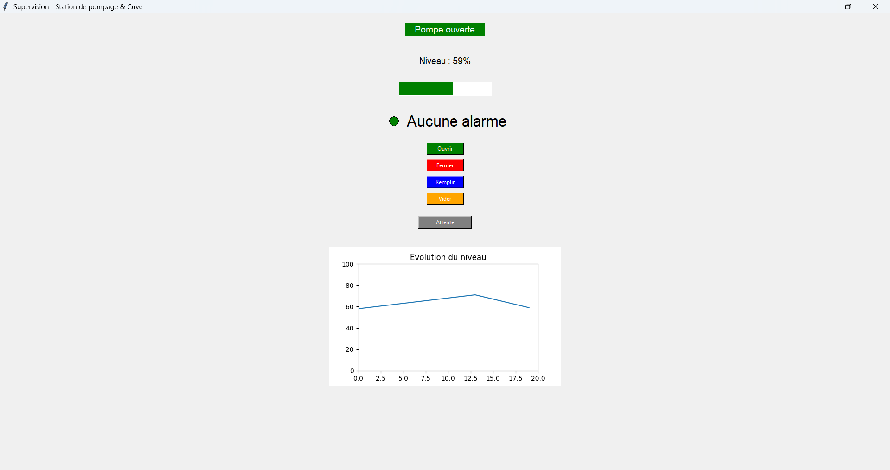
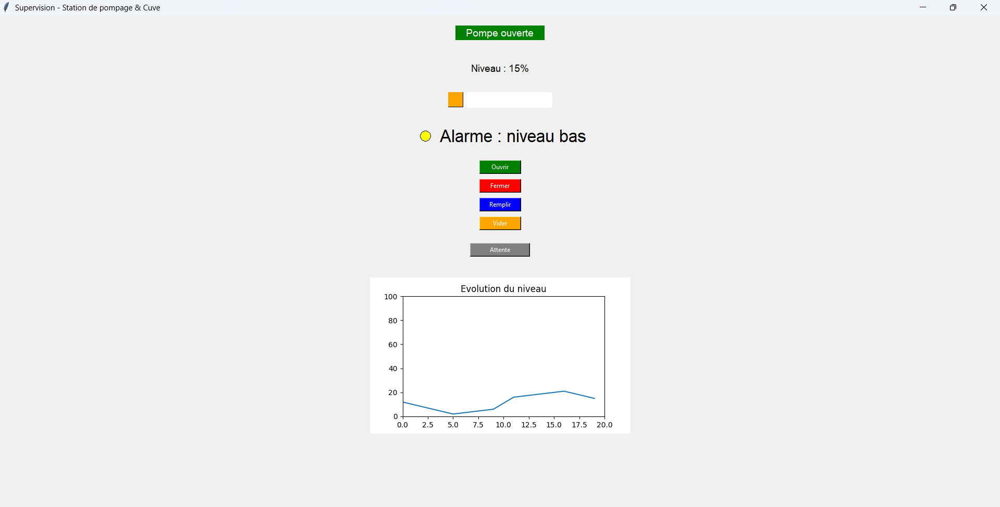
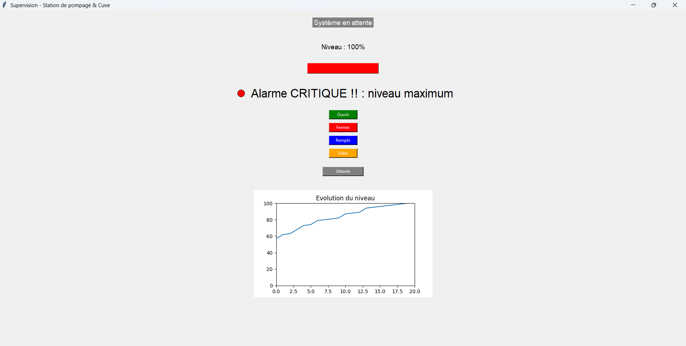
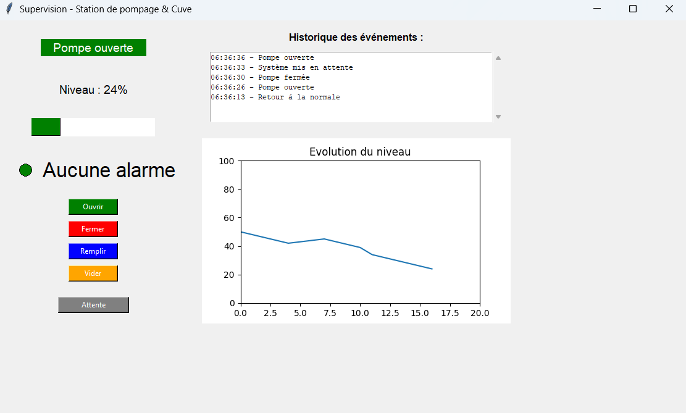
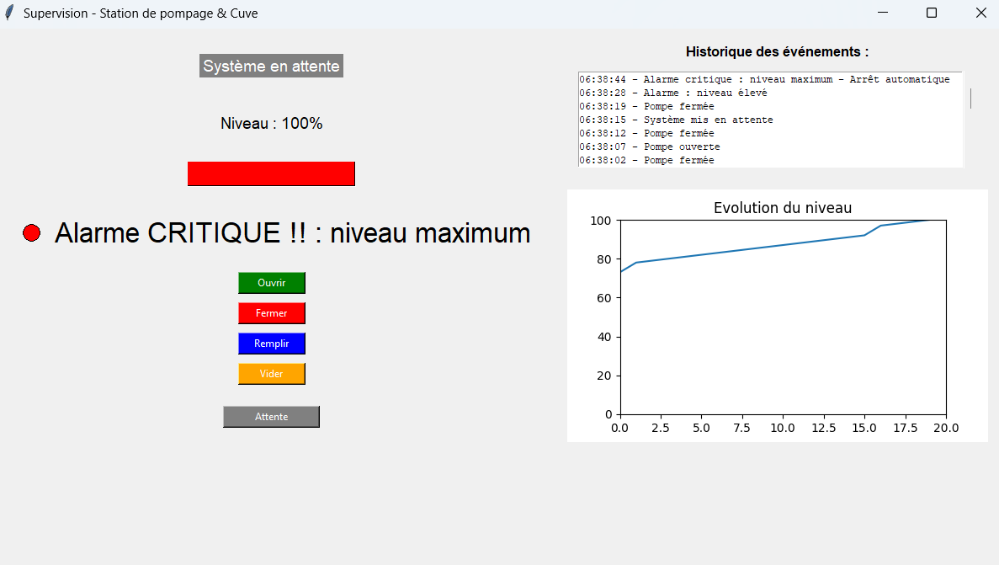
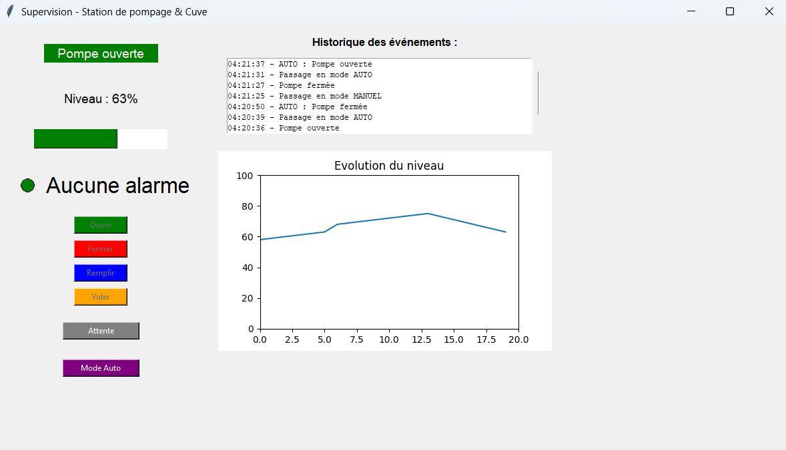
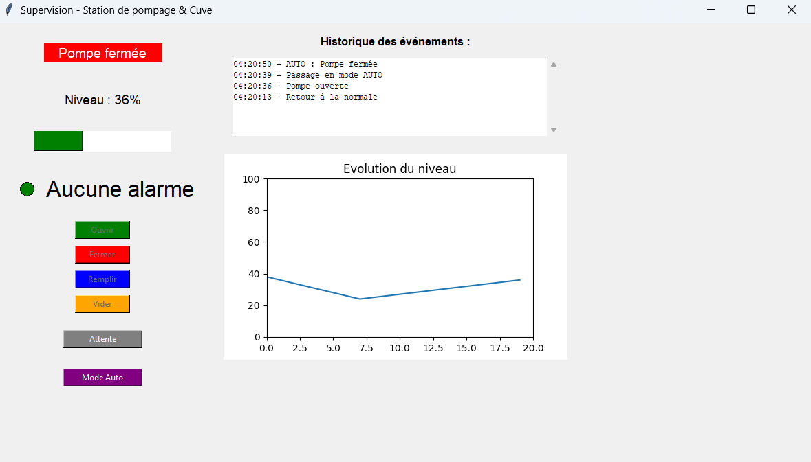
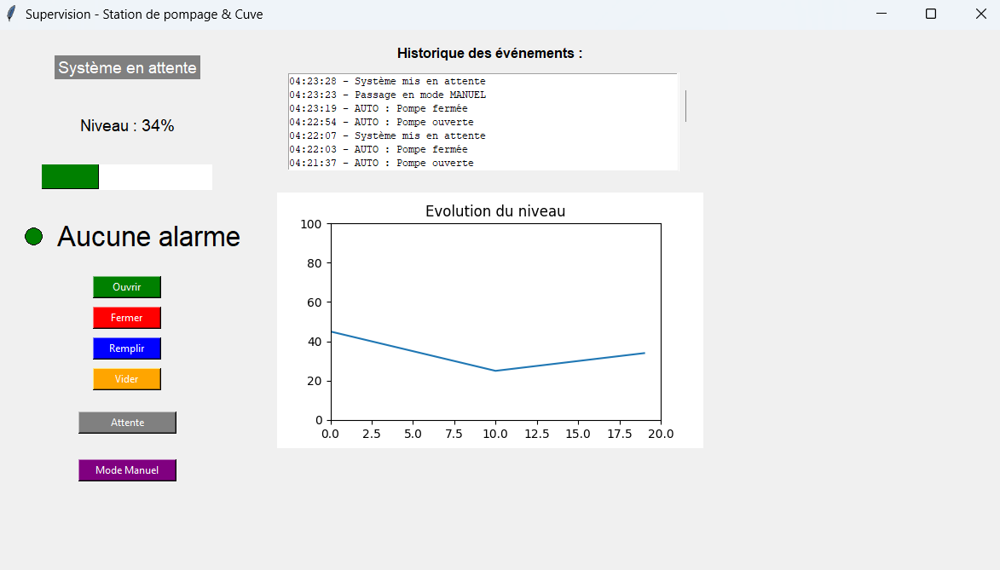

# 🏭 Pump Station SCADA Simulator


---

## 📌 Présentation

Application de supervision industrielle simulant une **station de pompage** avec interface graphique de type **SCADA (IHM)**, développée entièrement en Python.

> Ce projet reproduit le comportement d'un système industriel réel de type cuve + pompe, similaire à ceux utilisés en environnement SCADA (Siemens, Schneider).

Ce projet démontre des compétences en :
- 🔧 **Automatisme** — logique de fonctionnement, états système, interverrouillages
- 🖥️ **Supervision industrielle** — interface homme-machine (IHM), alarmes, voyants
- 🐍 **Programmation Python** — Tkinter, Matplotlib, cycle automatique

---

## 📸 Aperçu

| État normal | Alarme niveau bas | Alarme critique |
|---|---|---|
|  |  |  |


| Historique normal | Historique critique |
|---|---|
|  |  |


| Mode Auto pompe ON | Mode Auto pompe OFF | Mode Manuel |
|---|---|---|
|  |  |  |

---

## ⚙️ Fonctionnalités

### 🔹 Simulation du process
- Cuve avec niveau de **0% à 100%**
- Pompe **ON / OFF** avec cycle automatique toutes les secondes
- Pompe ON → niveau **diminue** (-2%/s)
- Pompe OFF → niveau **augmente** (+1%/s)

### 🔹 Interface graphique (IHM)
- Affichage de l'état du système (en attente / pompe ouverte / fermée)
- Affichage du niveau en temps réel
- **Barre de niveau visuelle** colorée (vert / orange / rouge)
- **Graphique historique** du niveau (20 derniers points)
- **Historique des événements** horodaté avec anti-doublons (insert en haut)

### 🔹 Système d'alarmes
| Seuil | Voyant | Description |
|-------|--------|-------------|
| 20% ≤ niveau ≤ 80% | 🟢 Vert fixe | Aucune alarme |
| niveau ≥ 80% | 🟠 Orange fixe | Alarme niveau haut |
| niveau ≤ 20% | 🟡 Jaune fixe | Alarme niveau bas |
| niveau = 100% ou 0% | 🔴 Rouge clignotant | **CRITIQUE — Arrêt automatique** |

### 🔹 Logique industrielle
- **Interverrouillage** : impossible de vider si pompe fermée, impossible de remplir si pompe ouverte
- **Arrêt automatique** aux seuils critiques (0% et 100%)
- **État système** : blocage au démarrage jusqu'à action utilisateur
- **Fermeture propre** de l'application (annulation des boucles `after()`)
- **Mode Automatique** : régulation autonome entre 25% et 75% (seuils sécurisés avant alarmes)
- **Mode Manuel** : prise en main opérateur avec boutons actifs

---

## 🎮 Utilisation

1. Lancer l'application avec `python main.py`
2. Cliquer sur **Ouvrir** pour démarrer la pompe → le niveau diminue
3. Cliquer sur **Fermer** pour arrêter la pompe → le niveau monte
4. Passer en **Mode Auto** → le système régule seul entre 25% et 75%
5. Observer les **alarmes** et le **voyant** selon le niveau
6. Consulter l'**historique des événements** en temps réel
7. Passer en **Mode Manuel** pour reprendre le contrôle

> ⚠️ En mode Auto, les boutons manuels sont désactivés automatiquement.

---

## 🛠️ Technologies utilisées

| Technologie | Usage |
|-------------|-------|
| Python 3.x | Langage principal |
| Tkinter | Interface graphique (IHM / SCADA) |
| Matplotlib | Graphique historique du niveau |

---

## 🚀 Lancement

### Prérequis
```bash
pip install matplotlib
```

### Démarrage
```bash
python main.py
```

---

## 🗂️ Structure du projet

```
pump-station-scada-simulator-python/
│
├── main.py                  # Application principale
├── .gitignore               # Fichiers exclus de Git
├── README.md                # Documentation du projet
│
└── screenshots/             # Captures d'écran de l'interface
    ├── etat_normal.png
    ├── alarme_orange.png
    ├── alarme_critique.png
    └── graphique.png
```

---

## 🧠 Concepts d'automatisme appliqués

- **Cycle automate** — simulation d'un cycle PLC avec `after(1000ms)`
- **États système** — attente / marche / arrêt automatique
- **Interverrouillages** — conditions de sécurité réalistes
- **Gestion des alarmes** — seuils bas / haut / critique
- **IHM SCADA** — voyants, barres de niveau, historique graphique

---

## 🔮 Évolutions prévues

- [X] Mode **Automatique / Manuel**
- [X] **Historique des événements** horodaté
- [ ] Restructuration du code en modules séparés ( `logique.py` , `interface.py` )- [ ] Communication **Modbus TCP**
- [ ] Connexion **TIA Portal / PLCSIM** (Siemens)

---

## 👤 Auteur

**HAMDI Sid-Ahmed**  
Technicien en Automatisme & Supervision Industrielle  
🔗 [Mon profil LinkedIn](https://www.linkedin.com/in/hamdi-sid-ahmed)

---

> 💡 *Projet réalisé dans le cadre d'un apprentissage autonome en automatisme industriel et supervision Python.*
